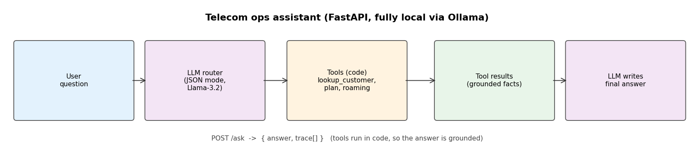

# telecom-ops-agent

A tool-using assistant for telecom operations. An LLM router (JSON mode) decides what a request
needs, the tools run in code (a SQLite customer lookup, plan details, a roaming-cost estimator) so
the answer is grounded in real data rather than invented, and the LLM writes the final answer from
the tool results. Served via FastAPI, fully local via Ollama, no API keys.

## Run
    pip install -r requirements.txt
    python src/db.py               # seed the customer DB
    python src/agent.py "Customer C001 is abroad for 5 days, is roaming covered and what is their balance?"
    uvicorn src.api:app            # POST /ask {"question": "..."}

## Example
**Q:** Customer C001 is traveling abroad for 5 days. Is roaming covered, and what is their balance?

**Trace:** `lookup_customer(C001)` → `roaming_cost(Unlimited Pro, 5)`

**A:** Yes, roaming is covered for Customer C001 since their plan includes 10 GB of roaming. Their balance is $12.0.

## How it works
For the question above the router returns customer_id C001 and the needs (roaming). Code calls
`lookup_customer(C001)` to get the plan and balance, then `roaming_cost(plan, days)`, and the LLM
answers from those facts. The tool-call trace is returned in the API response. Putting orchestration
in code keeps it reliable on a small local model and prevents invented data.
